<div align="center">


# L.I.V.I.A.

### Leitura Inteligente e Visualização de Informações de Armazenamento

**Entenda o que ocupa seu disco, pesquise o índice inteiro e navegue sem ficar reescaneando a mesma árvore.**


</div>

---

## Visão geral

A **L.I.V.I.A.** é um analisador de armazenamento local-first para Windows e Linux, agora também com um **protótipo Android na v0.9.0**. No desktop, ela percorre pastas e unidades, organiza consumo por diretório e extensão, mostra os maiores arquivos e aponta itens que merecem revisão. No Windows, unidades NTFS elegíveis ainda ganham os caminhos acelerados de MFT/USN; no Linux, a leitura usa o scanner compatível baseado em WalkDir. No Android, o usuário pode continuar escolhendo apenas uma pasta via Storage Access Framework ou conceder, explicitamente, acesso amplo ao armazenamento compartilhado para uma análise mais completa.

Na **v0.2.1**, a análise deixa de ser apenas um relatório descartável e passa a construir um **índice de sessão**. Busca, filtros e drill-down trabalham nesse índice em vez de obrigar o disco a reviver a mesma caminhada toda vez que o usuário clica numa pasta. Um conceito revolucionário conhecido como “não fazer trabalho duas vezes”.

## Conheça a Lívia

A interface agora tem uma personagem própria: **Lívia**, a cyber assistente que vive no canto do aplicativo e reage ao que está acontecendo sem interromper o trabalho.

Ela foi desenhada para ser útil antes de ser decorativa: cabelo lilás/prateado, olhos violeta, headset tecnológico e a mesma linguagem visual roxa do app. A personalidade é divertida, irônica e direta, mas as recomendações continuam conservadoras. A personagem pode fazer piada com a pasta Downloads; a aplicação continua sem autorização para fazer besteira no disco.

- **Analisando:** acompanha a varredura e mostra o progresso em linguagem humana.
- **Explicando:** ao selecionar arquivos como DLL, PAK, ISO, SYS, ZIP ou JSON, explica o que aquele tipo normalmente representa.
- **Julgando com carinho:** comenta arquivos muito antigos e duplicatas confirmadas.
- **Contextual:** usa os assets oficiais **Normal, Feliz, Explicando, Julgando, Preocupada e Escaneando** conforme o estado do aplicativo.
- **Não intrusiva:** o avatar fica no canto; o balão pode ser fechado e reaparece apenas em eventos relevantes.
- **Seguro por design:** nenhuma fala da Lívia transforma sugestão em exclusão automática.

### Assets oficiais da personagem

A tira acima é a fonte visual usada pelo próprio aplicativo. Não existe mais uma “versão vetorial aproximada” da mascote: o avatar do canto usa os mesmos chibis aprovados, recortados como sprites.

| Estado visual | Uso principal |
| --- | --- |
| **Normal** | espera / início |
| **Feliz** | análise concluída sem grande alerta |
| **Explicando** | arquivo selecionado e explicações de extensão |
| **Julgando** | duplicatas, excesso de itens e comentários irônicos |
| **Preocupada** | erros e situações que pedem cautela |
| **Escaneando** | varredura do disco e confirmação por hash |


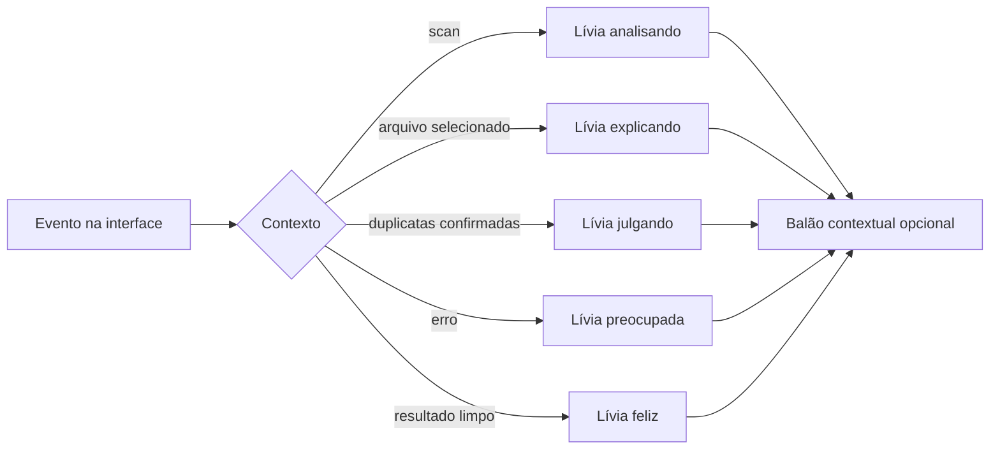

## Estado atual

| Recurso | Estado |
| --- | :---: |
| Scanner Rust responsivo | ✅ |
| Progresso e cancelamento | ✅ |
| Tema claro e escuro | ✅ |
| Guia contextual Lívia | ✅ v0.2.3 |
| Explicações por tipo de arquivo | ✅ v0.2.3 |
| Treemap interativo | ✅ |
| Pizza/Donut por pasta e extensão | ✅ v0.2.3 |
| Preferência de visualização persistente | ✅ v0.2.3 |
| Breadcrumb / drill-down | ✅ |
| Índice completo da sessão | ✅ v0.2.1 |
| Busca global no índice | ✅ v0.2.1 |
| Navegação sem nova varredura | ✅ v0.2.1 |
| MFT automático em raiz NTFS | ✅ experimental |
| Fallback seguro sem MFT | ✅ |
| Abrir arquivo no Explorer | ✅ |
| Triagem inicial de duplicatas | ✅ |
| Hash parcial + confirmação completa | ✅ v0.2.2 |
| Espaço recuperável confirmado | ✅ v0.2.2 |
| Limpeza assistida para a Lixeira | ✅ v0.3.0 |
| Desfazer seguro na sessão | ✅ v0.3.1 |
| Seleção assistida de duplicatas | ✅ v0.3.1 |
| Índice persistente entre execuções | ✅ v0.4.0 |
| Snapshots locais do armazenamento | ✅ v0.4.0 |
| Atualização incremental via USN Journal | ✅ v0.4.1 |
| Histórico visual do armazenamento | ✅ v0.5.0 |
| Crescimento por pasta e extensão | ✅ v0.5.0 |
| Leitura inteligente e prioridades locais | ✅ v0.5.1 |
| Atualização pelo próprio aplicativo | ✅ v0.6.0 |
| Validação SHA-256 do instalador | ✅ v0.6.0 |
| Notas da release e controle de avisos | ✅ v0.6.1 |
| Exportação JSON e CSV | ✅ v0.7.0 |
| Tipografia ampliada / legibilidade | ✅ v0.7.2 |
| Landing animada + apoio via Pix | ✅ v0.7.1 |
| Retratos da Lívia sem distorção + segunda passada de legibilidade | ✅ v0.7.2 |
| Linux desktop (AppImage + .deb) | ✅ v0.7.3 |
| Updater multiplataforma Windows/Linux | ✅ v0.7.3 |
| Android via Storage Access Framework | ✅ v0.8.0 protótipo |
| Android: análise do armazenamento compartilhado + marca correta | ✅ v0.8.1 protótipo |
| Android: ícone oficial no launcher | ✅ v0.8.2 protótipo |
| Índice com checksum, backup e recuperação automática | ✅ v0.9.0 |
| Pipeline Android release assinada (AAB + APK) | ✅ preparação v1.1 |

## Preparação da v1.1 — Android público e assinado

A trilha Android agora possui um caminho separado para **artefatos de produção**, sem misturar a build debug de testes com o pacote que um dia vai para a Play Store.

### Gate já preparado

- [x] patcher idempotente do `build.gradle.kts` gerado pelo Tauri;
- [x] configuração de `signingConfigs.release` aplicada somente após `tauri android init`;
- [x] keystore materializado apenas no runner do GitHub Actions;
- [x] validação do alias e senha com `keytool` antes do build;
- [x] AAB release assinado para todas as ABIs suportadas;
- [x] APK release assinado como artefato auxiliar;
- [x] validação do AAB com `jarsigner`;
- [x] validação do APK com `apksigner`;
- [x] SHA-256 dos dois artefatos;
- [x] workflow separado da build debug atual;
- [ ] upload key/keystore configurada nos GitHub Secrets;
- [ ] primeiro AAB enviado manualmente à Play Console;
- [ ] Play App Signing habilitado e identidade de publicação confirmada;
- [ ] publicação automatizada via Google Play Developer API em fase posterior.

### Secrets necessários

O workflow `Android public release artifacts` exige:

- `ANDROID_KEY_BASE64`: conteúdo Base64 do keystore JKS;
- `ANDROID_KEY_ALIAS`: alias da upload key;
- `ANDROID_KEY_PASSWORD`: senha do keystore/chave usada pelo fluxo.

O keystore e o arquivo `keystore.properties` nunca entram no repositório. A pasta gerada `src-tauri/gen/` já permanece ignorada pelo Git.

O primeiro upload do AAB na Play Console continua manual: é nessa etapa que o Google valida o bundle identifier e a assinatura inicial. Depois disso podemos ligar a automação de publicação sem fingir que a Play Store é uma pasta de rede com botão “copiar”. 

## Preparação da v1.0 — Desktop estável e assinado

A base técnica da release estável passa a tratar **canal de atualização** e **identidade do publisher** como parte da segurança, não como enfeite de marketing.

### Gate já preparado

- [x] builds estáveis ignoram GitHub Releases marcadas como prerelease;
- [x] builds de teste continuam podendo acompanhar release candidates;
- [x] updater mantém validação SHA-256 em duas etapas;
- [x] builds Windows assinadas embutem o thumbprint esperado do publisher;
- [x] antes de executar uma atualização, a build assinada valida Authenticode e exige o mesmo thumbprint;
- [x] pipeline automática de prerelease não publica versões SemVer estáveis;
- [x] workflow manual da v1.0 exige certificado, senha e servidor de timestamp;
- [x] o instalador é verificado após a assinatura e **antes** da criação da release estável;
- [x] Linux entra na mesma release estável com AppImage/.deb e checksums;
- [ ] certificado de code signing confiável configurado nos GitHub Secrets;
- [ ] primeira execução real do workflow estável com a versão `1.0.0`.

### Credenciais externas necessárias

O repositório **não** armazena chave privada. Para publicar a v1.0 pelo fluxo PFX, o ambiente do GitHub precisa receber:

- `WINDOWS_CERTIFICATE`: PFX codificado em Base64;
- `WINDOWS_CERTIFICATE_PASSWORD`: senha de exportação do PFX;
- `WINDOWS_TIMESTAMP_URL`: variável do repositório apontando para o timestamp server recomendado pela autoridade certificadora.

Sem essas três entradas o workflow falha antes da publicação. Uma release chamada “assinada” sem assinatura seria um conceito bastante inovador, mas não particularmente útil.

## v0.9.0 — Hardening e recuperação de estado

A L.I.V.I.A. agora trata o índice persistente como dado que pode sobreviver a encerramento abrupto, arquivo truncado e gravação interrompida, em vez de apostar que JSON e eletricidade manterão um relacionamento saudável para sempre.

### Entregas

- [x] checksum SHA-256 embutido no índice persistido;
- [x] compatibilidade de leitura com índices antigos sem checksum;
- [x] escrita em arquivo temporário com `sync_all` antes da troca;
- [x] preservação da geração anterior em `.bak`;
- [x] rollback do backup se a troca final falhar;
- [x] recuperação automática quando o índice principal está corrompido;
- [x] fallback equivalente para o histórico de snapshots;
- [x] indicação na interface quando o backup precisou ser restaurado;
- [x] fala contextual da Lívia para a recuperação;
- [x] teste automatizado que corrompe o arquivo principal e valida a restauração.

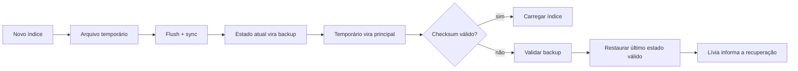

## v0.8.2 — Ícone correto no launcher Android

A v0.8.1 corrigiu a marca **dentro do aplicativo**, mas o Android continuou exibindo o logo padrão do template Tauri no launcher. O motivo era simples e irritante: `tauri android init` recria o projeto Android com os mipmaps padrão, e a pipeline não regenerava os ícones depois dessa etapa.

### Entregas

- [x] executar `tauri icon` **depois** de `tauri android init` no CI e na release;
- [x] usar `public/livia/livia-mark.svg` como fonte única da identidade visual;
- [x] gerar os mipmaps `ic_launcher` em todas as densidades Android;
- [x] validar a existência dos assets antes de compilar o APK;
- [x] remover o nome de artefato de CI preso na antiga v0.8.0;
- [x] preservar o ícone correto também nas próximas releases.

> A documentação oficial do Tauri recomenda exatamente esse fluxo para trocar o ícone Android após a inicialização do projeto. Porque aparentemente até um ícone precisa de ritual de invocação próprio.

## v0.8.1 — Android: armazenamento amplo + identidade correta

A primeira rodada em aparelho real expôs duas coisas que emulador adora esconder por esporte: o SAF não permite selecionar a raiz do armazenamento compartilhado em Android recente e a barra superior ainda estava usando um placeholder com a letra **L**. A v0.8.1 corrige os dois pontos sem abandonar o modo conservador por pasta.

### Entregas

- [x] novo botão **Analisar armazenamento inteiro**;
- [x] ponte nativa Android para solicitar `MANAGE_EXTERNAL_STORAGE` de forma explícita;
- [x] análise do armazenamento compartilhado usando o scanner nativo da L.I.V.I.A.;
- [x] modo SAF preservado como alternativa para analisar apenas uma pasta;
- [x] cancelamento também funciona durante a análise ampla;
- [x] a barra superior agora usa a marca oficial da L.I.V.I.A., em vez do placeholder **L**;
- [x] permissão ampla continua opcional;
- [x] Android permanece somente leitura nesta fase;
- [x] áreas privadas protegidas de outros aplicativos continuam fora do escopo;
- [x] release notes e pipeline atualizados para a v0.8.1.

> **Escopo real do “armazenamento inteiro”**: significa o armazenamento compartilhado que o Android permite ao aplicativo administrar. O sistema operacional ainda isola dados privados de outros apps, então a L.I.V.I.A. não promete atravessar a sandbox do Android como se segurança fosse decoração.

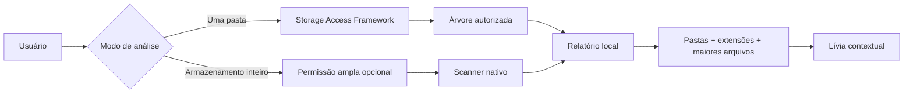

## v0.8.0 — Protótipo Android via SAF

A L.I.V.I.A. agora possui um **APK Android funcional e instalável**, construído com Tauri 2 e acesso ao armazenamento pelo **Storage Access Framework (SAF)**. O protótipo não pede acesso irrestrito ao aparelho: o usuário escolhe uma pasta e a análise fica confinada à árvore autorizada.

### Entregas

- [x] projeto Android inicializado pelo Tauri 2 em CI;
- [x] APK ARM64 debug gerado automaticamente;
- [x] seleção de pasta pelo picker nativo do Android;
- [x] persistência da permissão da URI escolhida quando o provedor permite;
- [x] leitura recursiva de metadados via SAF;
- [x] tamanho total, quantidade de arquivos e quantidade de pastas;
- [x] ranking dos maiores arquivos;
- [x] distribuição por pasta e extensão;
- [x] gráficos donut reaproveitados da interface desktop;
- [x] Lívia contextual integrada à interface móvel;
- [x] tema claro/escuro e layout touch-first;
- [x] cancelamento da análise;
- [x] limite de segurança de 250 mil entradas no protótipo;
- [x] nenhuma solicitação de `MANAGE_EXTERNAL_STORAGE`;
- [x] limpeza, restauração e updater desktop bloqueados no Android;
- [x] CI validando Windows, Linux e Android na mesma revisão.

### Segurança do protótipo

A v0.8.0 no Android é **somente leitura**. Ela enumera metadados das URIs autorizadas e monta o relatório localmente. Não remove arquivos, não tenta contornar o modelo de permissões do Android e não envia o índice para serviços externos.

O APK desta fase é uma **build debug ARM64 para testes**, não uma distribuição de Play Store. A versão pública Android continua prevista para a v1.1, quando entram assinatura de release, AAB, testes de dispositivo e fluxo de atualização próprio da plataforma.

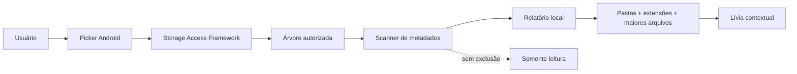

## v0.7.3 — Linux desktop + base multiplataforma

A L.I.V.I.A. deixa de tratar “desktop” como sinônimo de Windows. O mesmo núcleo de índice, busca, duplicatas, snapshots, histórico e limpeza assistida agora possui caminho oficial de build para Linux.

### Entregas

- [x] CI completo em Ubuntu 22.04 além do Windows;
- [x] pacotes Linux em AppImage e .deb;
- [x] persistência em `$XDG_STATE_HOME/livia` ou `~/.local/state/livia`;
- [x] abertura de pastas pelo gerenciador padrão via `xdg-open`;
- [x] proteção explícita de diretórios críticos Unix durante limpeza assistida;
- [x] comparação de caminhos respeita case sensitivity fora do Windows;
- [x] updater escolhe assets por plataforma;
- [x] AppImage e .deb exigem checksum SHA-256 publicado na release;
- [x] Windows continua usando NSIS e os caminhos NTFS/MFT/USN;
- [x] landing detecta Linux e entrega o pacote quando o asset está disponível.

O código compartilhado continua igual onde faz sentido. O que depende do sistema operacional fica explícito. É menos “mágica multiplataforma” e mais engenharia que admite que `C:\\` e `/` não são a mesma religião.

## v0.7.2 — Legibilidade reforçada + retratos corrigidos

A interface passa por uma segunda revisão de escala visual com foco em monitores de alta resolução. Textos auxiliares, labels, tabelas, tooltips e falas da Lívia deixam de depender de tamanhos microscópicos.

### Entregas

- [x] aumento controlado dos textos de 8–14 px em toda a interface;
- [x] botões, labels, métricas e textos secundários mais legíveis;
- [x] retrato da Lívia passa a respeitar a proporção real da sprite;
- [x] avatar desktop e mobile deixam de esticar cada expressão para um quadrado;
- [x] cards de expressão da landing usam escala menor e mais nítida;
- [x] microtextos da landing ampliados;
- [x] Pix copia-e-cola mantido com CRC válido e sem valor fixo.

A sprite original ainda é um bitmap compacto. Esta release evita ampliar e deformar esse arquivo além do necessário; a troca por arte-fonte em resolução maior continua prevista assim que o asset mestre estiver disponível.

## v0.2.1 — Index & Search

### Entregas

- [x] indexar todos os arquivos encontrados durante a análise;
- [x] manter o índice somente na sessão;
- [x] pesquisa global por nome ou caminho;
- [x] filtros por extensão e tamanho sobre o índice completo;
- [x] ordenação no backend;
- [x] drill-down pelo treemap sem nova leitura física;
- [x] breadcrumb usando o mesmo índice;
- [x] painel informa quantos arquivos estão indexados;
- [x] tentativa automática de enumeração NTFS/MFT ao analisar a raiz de uma unidade;
- [x] fallback transparente para o scanner compatível quando MFT não puder ser usado;
- [x] README atualizado;
- [x] validar CI Windows;
- [x] validar instalador;
- [x] publicar v0.2.1.

### MFT e privilégios

O caminho acelerado usa enumeração da **Master File Table** quando a análise parte da raiz de uma unidade NTFS e o processo possui privilégios suficientes.

O acesso direto à MFT no Windows requer elevação. A L.I.V.I.A. **não se autoeleva** e não força UAC. Se o acesso não estiver disponível, a análise continua com o scanner convencional e informa o fallback na interface.

Isso é intencional: pedir permissão administrativa automaticamente só para parecer rápido seria uma maneira impressionante de piorar ainda mais a primeira impressão de um aplicativo que já precisa lidar com SmartScreen.

## v0.2.2 — Duplicatas confiáveis

A verificação de duplicatas agora acontece **sob demanda**. A indexação inicial continua leve: primeiro os candidatos são agrupados por tamanho, depois a L.I.V.I.A. calcula um hash BLAKE3 de amostras do início e do fim dos arquivos e só lê o conteúdo inteiro dos grupos que continuam iguais.

### Entregas

- [x] agrupar candidatos em todo o índice pelo tamanho exato;
- [x] ignorar arquivos menores que 1 MB para evitar ruído;
- [x] hash parcial BLAKE3 com amostras de 64 KiB do início e do fim;
- [x] hash completo apenas nos candidatos que sobrevivem à triagem;
- [x] rejeitar arquivos cujo tamanho mudou desde a indexação;
- [x] mostrar progresso da verificação na interface;
- [x] mostrar grupos confirmados e espaço potencialmente recuperável;
- [x] manter a operação estritamente somente leitura;
- [x] validar CI Windows e instalador;
- [x] publicar v0.2.2.

### Fluxo da confirmação

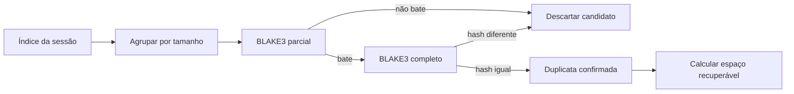

Nenhum arquivo é removido nesta fase. A L.I.V.I.A. só prova que os conteúdos são iguais e mostra onde eles estão. Humanos continuam responsáveis pelo botão destrutivo, uma tradição que estranhamente ainda faz sentido.

## v0.2.4 — Hotfix da Lívia

A v0.2.4 corrige um problema de empacotamento do asset da personagem: o arquivo WebP da sprite sheet havia sido publicado incompleto, então GitHub e aplicativo reservavam o espaço da imagem, mas não conseguiam decodificá-la.

### Correções

- [x] republicar a sprite sheet da Lívia como WebP válido;
- [x] restaurar a personagem no avatar do aplicativo;
- [x] restaurar a tira de expressões no README;
- [x] manter os estados **Normal, Feliz, Explicando, Julgando, Preocupada e Escaneando**;
- [x] validar o asset antes da release;
- [x] validar CI Windows e instalador;
- [x] publicar v0.2.4.

## v0.2.3 — Visualizações + Lívia

A área de análise agora pode alternar entre visualizações sem recalcular o índice. O objetivo é permitir leitura detalhada e leitura rápida do mesmo conjunto de dados, porque aparentemente uma única forma de enxergar 191 GB de Steam não era humilhante o bastante.

### Entregas

- [x] alternância **Mapa / Pizza** para distribuição por pasta;
- [x] alternância **Lista / Pizza** para extensões;
- [x] gráfico donut responsivo usando Recharts;
- [x] legenda com porcentagem, tamanho e contagem de arquivos;
- [x] agrupamento de categorias menores em **Outros**;
- [x] navegação pelo índice clicando em fatias e itens de pasta;
- [x] preferência de visualização salva localmente;
- [x] suporte aos temas claro e escuro;
- [x] avatar persistente da Lívia no canto da interface;
- [x] estados visuais contextuais para análise, resultado, erro, duplicatas e seleção de arquivo;
- [x] balões opcionais que abrem em eventos relevantes e podem ser fechados;
- [x] explicações para tipos comuns como DLL, PAK, SYS, ISO, ZIP, JSON e bancos locais;
- [x] comentários contextuais para arquivos antigos e duplicatas confirmadas;
- [x] suporte responsivo e integração com os temas claro e escuro;
- [x] validar CI Windows e instalador;
- [x] publicar v0.2.3.

## v0.3.0 — Limpeza assistida

A L.I.V.I.A. agora sai do modo “eu só observo a bagunça” e passa a ajudar na limpeza sem ganhar um lança-chamas apontado para o sistema de arquivos.

### Fluxo seguro

- [x] adicionar arquivos individualmente à bandeja de limpeza;
- [x] revisar quantidade e espaço antes de qualquer ação;
- [x] exigir uma segunda confirmação;
- [x] conferir se o arquivo ainda pertence ao índice;
- [x] conferir novamente tamanho e tipo antes de mover;
- [x] preservar arquivos que mudaram desde a indexação;
- [x] bloquear a pasta do Windows e o executável atual;
- [x] mover para a Lixeira do sistema, nunca excluir permanentemente;
- [x] atualizar o índice em memória depois da operação;
- [x] manter histórico local resumido sem persistir caminhos de arquivos;
- [x] fazer a Lívia reagir à seleção, execução e conclusão da limpeza;
- [x] restauração direta pela interface com identificação segura na sessão (v0.3.1).

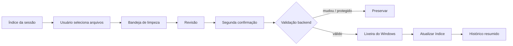

## v0.3.1 — Desfazer seguro + revisão de duplicatas

A limpeza agora fecha o ciclo: a L.I.V.I.A. tenta identificar a **entrada exata** criada na Lixeira para cada arquivo movido. Quando essa identificação é inequívoca, a operação ganha um botão **Desfazer** durante a sessão atual.

Isso é deliberadamente conservador. Se a entrada não puder ser ligada com segurança ao arquivo que a L.I.V.I.A. acabou de mover, o aplicativo não inventa um vínculo só para poder exibir um botão bonito.

### Entregas

- [x] registrar a Lixeira antes e depois da limpeza para identificar somente itens novos;
- [x] vincular o item pelo identificador do sistema e pelo caminho original;
- [x] manter os identificadores da Lixeira somente em memória;
- [x] restaurar arquivos ao caminho original pela API da Lixeira;
- [x] tratar colisões/erros sem restaurar “o arquivo mais parecido”;
- [x] recolocar arquivos restaurados no índice atual quando ele ainda corresponde à mesma raiz;
- [x] histórico mais rico com movidos, preservados e restaurados;
- [x] histórico persistente continua sem caminhos ou identificadores da Lixeira;
- [x] botão **Selecionar cópias** em duplicatas confirmadas;
- [x] seleção em lote preserva explicitamente a primeira cópia da lista para revisão;
- [x] Lívia reage ao desfazer, à restauração concluída e à seleção assistida de duplicatas.

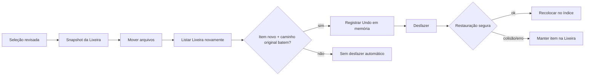

O desfazer é **ligado à sessão atual**. Ao fechar a aplicação, os identificadores do sistema operacional são descartados. O histórico resumido continua existindo, mas sem dados suficientes para executar uma restauração automática depois de reabrir o app. É menos mágico e muito menos irresponsável.

## v0.4.0 — Memória persistente + snapshots

A L.I.V.I.A. agora **lembra do último índice**. Depois de uma análise concluída, o índice completo fica salvo localmente e é restaurado na próxima abertura sem exigir uma nova varredura física.

Também é criado um snapshot resumido a cada nova indexação. Isso prepara o terreno para a comparação temporal das próximas releases.

### Entregas

- [x] persistência local do índice completo;
- [x] restauração automática do último índice na inicialização;
- [x] snapshots resumidos por raiz analisada;
- [x] até 60 snapshots locais por histórico;
- [x] snapshot registra tamanho, arquivos, pastas, engine e horário;
- [x] mini timeline no dashboard com os snapshots recentes;
- [x] delta de espaço em relação ao snapshot anterior;
- [x] limpeza e desfazer atualizam o índice persistente;
- [x] nenhum índice ou snapshot é enviado para fora do computador;
- [x] Lívia reconhece quando recuperou o armazenamento da memória local.

Os arquivos de estado ficam em `%LOCALAPPDATA%\L.I.V.I.A\state`. O índice é versionado por schema para que futuras mudanças possam invalidar formatos antigos sem interpretar lixo como verdade. Um luxo conhecido em alguns círculos como “não corromper os dados do usuário”.

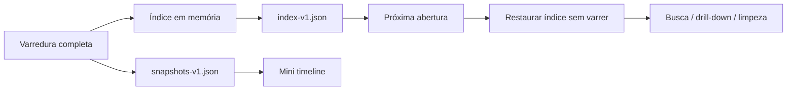

## v0.4.1 — USN Journal + atualização incremental

Em unidades NTFS elegíveis, a L.I.V.I.A. agora salva um **checkpoint do USN Journal** junto do índice. Ao clicar em **Atualizar índice**, ela tenta ler apenas as alterações ocorridas desde esse checkpoint.

Se o journal tiver sido recriado, o checkpoint tiver expirado, houver mudança estrutural de diretório, o volume não permitir acesso ou o lote de mudanças ficar grande demais, a L.I.V.I.A. abandona a rota incremental e **reconstrói o índice completo automaticamente**. Nada de insistir numa otimização quando a premissa deixou de ser confiável. Seria muito humano.

### Entregas

- [x] checkpoint `journalId + nextUsn` salvo no índice persistente;
- [x] leitura incremental iniciando no último USN conhecido;
- [x] atualização/remoção apenas dos arquivos apontados pelo journal;
- [x] engine `NTFS / USN incremental` visível no relatório;
- [x] fallback automático para indexação completa;
- [x] fallback em alterações estruturais de diretório;
- [x] fallback quando o checkpoint sai da janela válida;
- [x] limite de segurança para lotes excessivos de eventos;
- [x] novo snapshot após cada atualização;
- [x] Lívia explica se a atualização foi incremental ou completa.

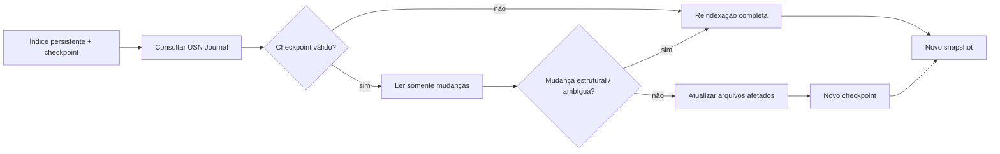

## v0.5.0 — Histórico visual do armazenamento

Os snapshots deixaram de ser apenas números guardados em algum JSON melancólico. A L.I.V.I.A. agora transforma a memória do disco em uma **linha do tempo visual**, com comparação de crescimento por pasta e extensão.

### Entregas

- [x] gráfico temporal de espaço ocupado;
- [x] filtros de 7 dias, 30 dias e histórico completo;
- [x] comparação entre o snapshot atual e o início do período;
- [x] variação de quantidade de arquivos;
- [x] breakdown resumido de até 20 pastas por snapshot;
- [x] breakdown resumido de até 20 extensões por snapshot;
- [x] ranking das pastas que mais cresceram ou diminuíram;
- [x] ranking dos tipos de arquivo que mais mudaram;
- [x] compatibilidade com snapshots antigos sem breakdown;
- [x] Lívia comenta crescimento ou redução desde a leitura anterior.

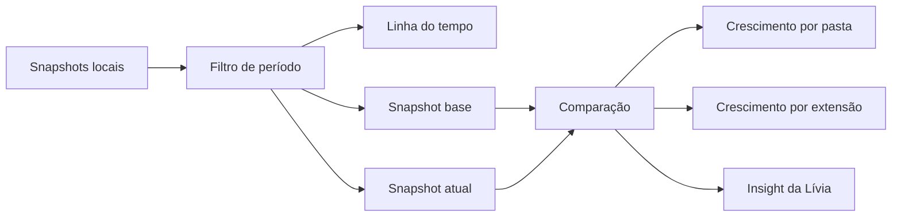

Snapshots anteriores à v0.5 continuam válidos. Eles aparecem no gráfico de tamanho total, mas só novos snapshots possuem breakdown detalhado por pasta e extensão. Inventar dados históricos que nunca foram coletados seria muito eficiente, pena que também seria mentira.


## v0.5.1 — Leitura inteligente

A L.I.V.I.A. agora cruza os dados que já coleta para montar uma fila de atenção local e explicável. Não existe “IA mágica” decidindo o destino dos arquivos: as prioridades vêm de regras visíveis sobre crescimento, tamanho, idade e duplicatas confirmadas.

### Entregas

- [x] painel **O que merece atenção agora**;
- [x] priorização alta, média e baixa;
- [x] espaço recuperável de duplicatas confirmadas entra na análise;
- [x] fila de revisão considera tamanho total dos itens sinalizados;
- [x] crescimento total entre os dois snapshots mais recentes;
- [x] pasta com maior crescimento recente;
- [x] extensão com maior crescimento recente;
- [x] ordenação determinística e totalmente local;
- [x] nenhuma remoção automática disparada pelos insights;
- [x] layout responsivo em tema claro e escuro.


## v0.6.0 — Atualização pelo próprio aplicativo

A L.I.V.I.A. agora consegue cuidar do caminho entre uma release publicada e a instalação no computador. O aplicativo consulta as releases do projeto, identifica versões superiores à instalada, baixa o instalador e valida a integridade antes de oferecê-lo ao usuário.

### Entregas

- [x] verificação automática discreta ao abrir o aplicativo;
- [x] verificação manual pela versão exibida na barra superior;
- [x] suporte às pré-releases atuais do projeto;
- [x] download do instalador sem abrir navegador;
- [x] progresso de download dentro da interface;
- [x] SHA-256 publicado automaticamente pela pipeline;
- [x] validação obrigatória do SHA-256 antes da execução;
- [x] instalador inválido é apagado e nunca executado;
- [x] prevenção de downgrade;
- [x] execução limitada ao instalador temporário esperado da L.I.V.I.A.;
- [x] instalação continua explícita: o usuário decide quando abrir o instalador;
- [x] falhas de rede não impedem o restante do aplicativo de funcionar.

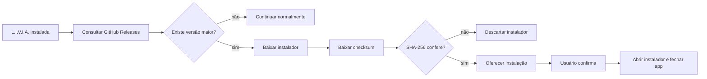


## v0.6.1 — Atualização menos insistente

A central de atualizações agora mostra o que mudou antes do usuário baixar qualquer coisa e respeita quando uma versão específica não interessa naquele momento. A atualização continua explícita e validada por SHA-256; a diferença é que o aplicativo parou de tratar toda nova release como uma emergência nacional.

### Entregas

- [x] exibir notas da release diretamente na central de atualizações;
- [x] limitar a prévia para manter o painel legível;
- [x] opção **Agora não** para fechar o aviso sem alterar preferências;
- [x] opção **Ignorar esta versão** persistida localmente;
- [x] versão ignorada deixa de abrir o painel automaticamente;
- [x] uma versão posterior volta a ser sinalizada normalmente;
- [x] download e instalação continuam disponíveis manualmente mesmo para uma versão ignorada;
- [x] README alinhado ao estado real do índice persistente e à versão atual.


## v0.7.0 — Relatórios exportáveis

A análise agora pode sair da tela sem sair do computador. A L.I.V.I.A. exporta um relatório completo em JSON ou um resumo em CSV para planilhas, mantendo o princípio local-first: o usuário escolhe o destino e nenhum dado é enviado para serviço externo.

### Entregas

- [x] botão **Exportar** disponível no dashboard após uma análise;
- [x] JSON completo com relatório atual, snapshots locais e duplicatas confirmadas da sessão;
- [x] CSV com resumo, pastas, extensões, arquivos grandes, recomendações, snapshots e duplicatas;
- [x] CSV com BOM UTF-8 e separador por ponto e vírgula para melhor compatibilidade com Excel em pt-BR;
- [x] nome de arquivo sugerido com raiz analisada e horário;
- [x] gravação feita pelo backend apenas em arquivos `.json` ou `.csv`;
- [x] limite de 100 MB por exportação;
- [x] nenhuma transmissão de dados durante a exportação.


## v0.7.1 — Legibilidade + landing pública

A v0.7.1 trata duas coisas que parecem pequenas até você ter que usar o produto de verdade: **texto legível** e uma página pública que não pareça um README usando blazer.

### Entregas

- [x] aumento sistemático das fontes de 7–11 px no aplicativo;
- [x] reforço de títulos, métricas e falas da Lívia;
- [x] landing page com hierarquia editorial e microanimações;
- [x] expressões da Lívia recortadas individualmente para evitar ampliar a sprite sheet inteira;
- [x] detecção de Windows/Linux e downloads via GitHub Releases;
- [x] botão de apoio voluntário com Pix;
- [x] QR Code Pix gerado localmente, sem serviço externo;
- [x] Pix copia e cola e chave com botões de cópia;
- [x] respeito a `prefers-reduced-motion`.

## Arquitetura

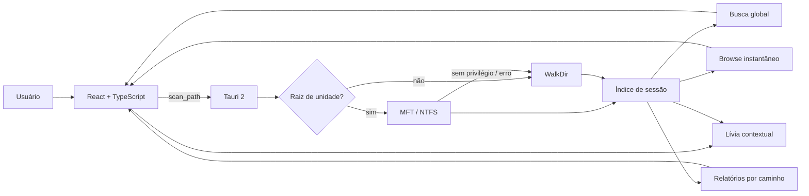

## Fluxo de navegação indexada

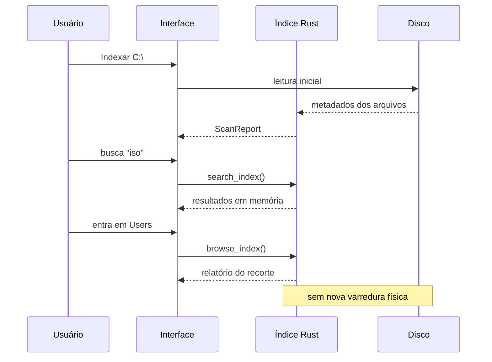

## Como a busca funciona

O índice armazena metadados de cada arquivo encontrado:

- caminho;
- nome;
- tamanho;
- extensão;
- data de modificação;
- idade calculada.

A interface pede ao backend somente os resultados necessários. O backend filtra o índice completo e devolve até 200 itens por consulta.

O índice é persistido localmente desde a v0.4.0 e restaurado na abertura seguinte. Em volumes NTFS elegíveis, a v0.4.1 também tenta atualizar esse índice de forma incremental via USN Journal antes de recorrer a uma reindexação completa.

## Segurança

A análise, a busca, o MFT e a confirmação de duplicatas continuam **somente leitura**. Desde a v0.4.0, o índice e snapshots são persistidos localmente em arquivos de estado da própria L.I.V.I.A.; esses dados não saem do computador.

A partir da **v0.3.0**, existe uma ação explícita de limpeza assistida. Ela só opera sobre arquivos que o usuário selecionou, exige revisão e confirmação, valida novamente tamanho e tipo do arquivo antes da ação e usa a **Lixeira do sistema** em vez de exclusão permanente. Arquivos dentro da pasta do Windows e o executável atual da L.I.V.I.A. são bloqueados pelo backend.

Na **v0.3.1**, o desfazer só fica disponível quando a L.I.V.I.A. consegue correlacionar de forma inequívoca o arquivo movido com a entrada nova criada na Lixeira. O identificador dessa entrada fica apenas em memória e morre junto com a sessão.

O caminho MFT também é somente leitura. Se ele não estiver disponível, o aplicativo não tenta “consertar” permissões, não altera políticas do Windows e não cria serviço privilegiado.

### SmartScreen

As builds ainda não possuem assinatura Authenticode com certificado confiável. O Windows pode exibir **Fornecedor desconhecido** até que a distribuição passe a ser assinada.

## Stack

| Camada | Tecnologia |
| --- | --- |
| Desktop | Tauri 2 |
| Android | Tauri 2 + Storage Access Framework |
| Scanner compatível | Rust + WalkDir |
| Scanner acelerado | NTFS MFT via Windows |
| Índice | memória + persistência local versionada |
| Interface | React 19 + TypeScript |
| Visualização | Recharts |
| CI / Release | GitHub Actions |

## Desenvolvimento

```bash
npm install
npm run tauri dev
```

Build desktop:

```bash
npm run tauri build
```

Protótipo Android:

```bash
npm run tauri -- android init
npm run tauri -- android build --debug --apk --target aarch64
```

## Roadmap

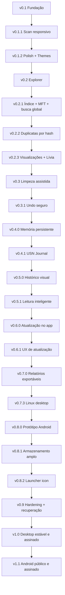

### v0.2.2 — Duplicatas confiáveis
- ✅ agrupamento global por tamanho;
- ✅ hash rápido parcial BLAKE3;
- ✅ confirmação por hash completo;
- ✅ cálculo confiável do espaço potencialmente recuperável.

### v0.2.3 — Visualizações + Lívia
- ✅ mapa/treemap interativo;
- ✅ gráficos de pizza/donut para pastas e extensões;
- ✅ troca de modo sem reindexação;
- ✅ preferências persistentes;
- ✅ Lívia como guia visual dentro do app;
- ✅ explicações contextuais de arquivos e reações por estado.

### v0.3 — Limpeza assistida
- ✅ seleção múltipla por bandeja de limpeza;
- ✅ prévia do espaço selecionado;
- ✅ Lixeira em vez de exclusão direta;
- ✅ validação do arquivo novamente antes de mover;
- ✅ proteção da pasta do Windows e do executável em uso;
- ✅ histórico local resumido das operações;
- ✅ v0.3.1: desfazer/restaurar quando a entrada exata da Lixeira puder ser identificada;
- ✅ v0.3.1: seleção assistida de cópias em grupos de duplicatas confirmadas.

### v0.4 — Persistência e mudanças
- snapshots locais;
- índice persistente;
- USN Journal para atualizar somente o que mudou;
- comparação de crescimento entre períodos.

### v0.6 — Atualização integrada
- ✅ consulta de versões publicadas no GitHub Releases;
- ✅ download dentro do aplicativo;
- ✅ checksum SHA-256 publicado pela pipeline;
- ✅ validação de integridade antes da execução;
- ✅ instalação iniciada somente por ação explícita do usuário;
- ✅ v0.6.1: notas da release no painel;
- ✅ v0.6.1: opção “Agora não”;
- ✅ v0.6.1: ignorar uma versão sem silenciar versões futuras.

### v0.7 — Relatórios exportáveis
- ✅ exportação JSON completa com relatório, snapshots e duplicatas confirmadas;
- ✅ exportação CSV amigável para Excel e similares;
- ✅ arquivo salvo somente no caminho escolhido pelo usuário;
- ✅ nenhuma transmissão externa durante a exportação;
- ✅ limite de segurança de 100 MB por arquivo exportado.

### Android — trilha paralela
- ✅ v0.8.0: protótipo Tauri 2 instalável;
- ✅ v0.8.0: Storage Access Framework para análise confinada a uma pasta;
- ✅ v0.8.1: acesso amplo opcional ao armazenamento compartilhado;
- ✅ v0.8.1: marca oficial no cabeçalho Android;
- ✅ v0.8.2: marca oficial também no ícone do launcher Android;
- ✅ UI adaptada para toque;
- ✅ APK ARM64 debug produzido no CI;
- ✅ v0.9: checksum, backup atômico e recuperação de falhas;
- v1.1: primeira versão Android pública, assinada e preparada para distribuição.

## Design

A referência visual contínua é o [Impeccable](https://impeccable.style/): ferramenta desktop primeiro, decoração depois, e nenhuma interface tentando ganhar prêmio por quantidade de cards.

## Licença

MIT.
