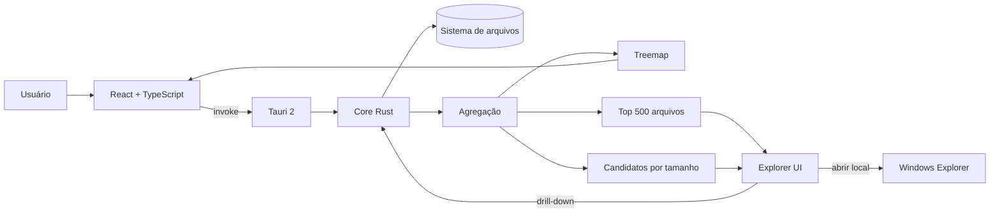
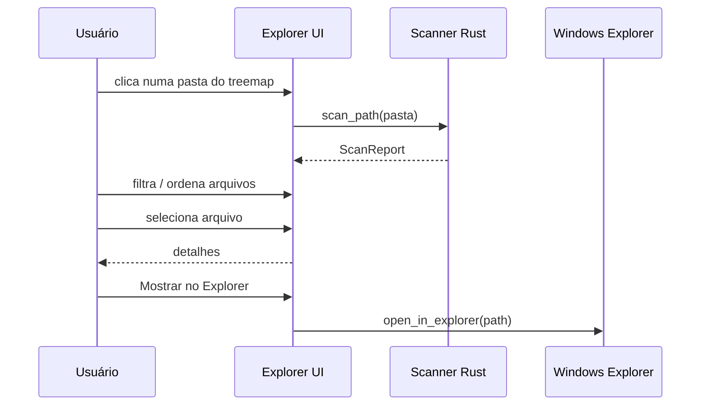
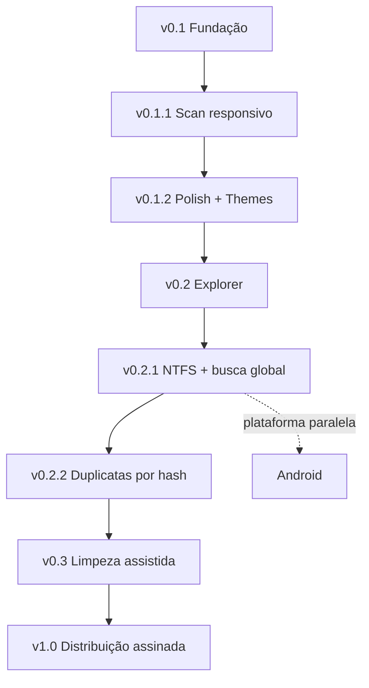

<div align="center">


# L.I.V.I.A.

### Leitura Inteligente e Visualização de Informações de Armazenamento

**Entenda o que ocupa seu disco, navegue pelos gargalos e decida com contexto.**


</div>

---

## Visão geral

A **L.I.V.I.A.** é um analisador de armazenamento local-first para Windows. Ela percorre pastas e unidades, organiza consumo por diretório e extensão, mostra os maiores arquivos e aponta itens que merecem revisão.

A v0.2 transforma o resultado de uma análise em algo navegável. Porque descobrir que `Program Files` pesa muito e depois ficar olhando para um retângulo colorido seria uma experiência humana extremamente previsível.

## Estado atual

| Recurso | Estado |
| --- | :---: |
| Scanner Rust responsivo | ✅ |
| Progresso e cancelamento | ✅ |
| Tema claro e escuro | ✅ |
| Treemap interativo | ✅ v0.2 |
| Breadcrumb / drill-down | ✅ v0.2 |
| Filtros por nome, extensão e tamanho | ✅ v0.2 |
| Tabela ordenável | ✅ v0.2 |
| Painel de detalhes | ✅ v0.2 |
| Abrir arquivo no Explorer | ✅ v0.2 |
| Triagem inicial de duplicatas por tamanho | ✅ v0.2 |
| Hash de duplicatas | 🗓️ Próxima etapa |
| Scanner NTFS/MFT | 🗓️ Próxima etapa |
| Android | 🗓️ Futuro |

## v0.2.0 — Explorer

A sprint atual adiciona uma camada de exploração sobre o scanner:

- [x] manter os 500 maiores arquivos em memória sem indexar o disco inteiro;
- [x] filtrar arquivos destacados por nome/caminho;
- [x] filtrar por extensão;
- [x] filtrar por tamanho mínimo;
- [x] ordenar por nome, tipo, idade e tamanho;
- [x] painel de detalhes;
- [x] abrir arquivo/local diretamente no Explorer;
- [x] treemap clicável para entrar em uma pasta;
- [x] breadcrumb para voltar pela hierarquia;
- [x] triagem de possíveis duplicatas por tamanho;
- [x] README atualizado;
- [ ] validar CI e instalador;
- [ ] publicar v0.2.0.

> **Importante:** a triagem de duplicatas ainda não compara conteúdo. Dois arquivos do mesmo tamanho são apenas candidatos. Hash entra antes de qualquer ação de limpeza.

## Arquitetura



## Fluxo de exploração



## Segurança

A L.I.V.I.A. continua **somente leitura**. Nenhum arquivo é removido nesta versão.

A triagem de duplicatas não autoriza exclusão e não é tratada como prova de igualdade. O Windows Explorer é aberto diretamente, sem shell intermediário ou janela de console.

### SmartScreen

As builds ainda não possuem assinatura Authenticode com certificado confiável. O Windows pode exibir **Fornecedor desconhecido** até que a distribuição passe a ser assinada.

## Stack

| Camada | Tecnologia |
| --- | --- |
| Desktop | Tauri 2 |
| Scanner | Rust |
| Interface | React 19 + TypeScript |
| Build | Vite |
| Visualização | Recharts |
| CI / Release | GitHub Actions |

## Desenvolvimento

```bash
npm install
npm run tauri dev
```

Build Windows:

```bash
npm run tauri build
```

## Roadmap



### v0.2.1 — Velocidade e índice
- benchmark em discos grandes;
- scanner NTFS especializado usando MFT;
- busca global;
- navegação sem reanálise completa quando houver índice disponível.

### v0.2.2 — Duplicatas confiáveis
- agrupamento por tamanho;
- hash rápido;
- confirmação por hash completo;
- cálculo de espaço recuperável sem sugerir exclusão automática.

### v0.3 — Limpeza assistida
- seleção múltipla;
- prévia do espaço recuperável;
- lixeira em vez de exclusão direta;
- histórico;
- desfazer quando possível.

### Android — futuro
- protótipo Tauri 2;
- Storage Access Framework;
- UI adaptada para toque;
- compartilhamento das regras de classificação possíveis entre plataformas.

## Design

A referência visual contínua é o [Impeccable](https://impeccable.style/): densidade de ferramenta desktop, hierarquia clara e nenhum elemento decorativo tentando se candidatar a protagonista.

## Licença

MIT.
