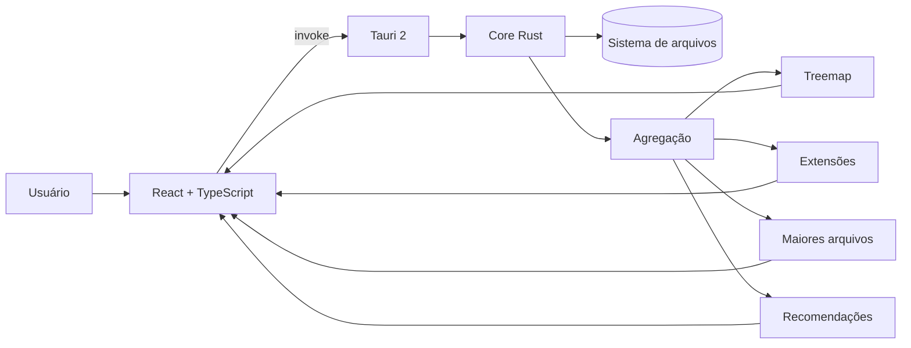
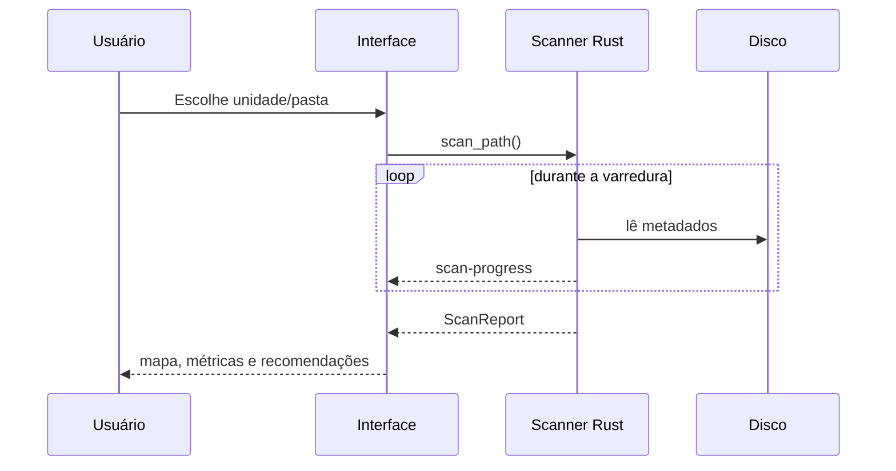
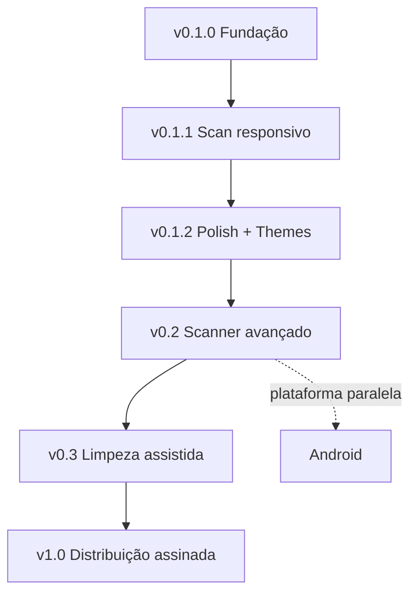

<div align="center">

# L.I.V.I.A.

### Leitura Inteligente e Visualização de Informações de Armazenamento

**Entenda o que ocupa seu disco sem transformar o computador num campo minado.**


</div>

---

## Visão geral

A **L.I.V.I.A.** é um analisador de armazenamento local-first para Windows. Ela percorre uma pasta ou unidade, organiza o consumo por diretório e extensão, destaca os maiores arquivos e aponta itens que merecem revisão.

A referência de problema é o WizTree. A diferença que buscamos é uma experiência mais clara, moderna e explicável, sem sugerir que todo arquivo velho merece execução sumária.

### O que já funciona

| Recurso | Estado |
| --- | :---: |
| Scanner recursivo em Rust | ✅ |
| Análise completa do disco do sistema | ✅ |
| Interface responsiva durante o scan | ✅ |
| Progresso ao vivo | ✅ |
| Cancelamento | ✅ |
| Treemap por pasta | ✅ |
| Maiores arquivos e extensões | ✅ |
| Recomendações somente leitura | ✅ |
| Tema claro e escuro | 🛠️ v0.1.2 |
| Aplicativo sem console auxiliar | 🛠️ v0.1.2 |
| Android | 🗓️ Futuro |

## Arquitetura



## Fluxo de análise



## v0.1.2 — Polish & Themes

Esta etapa está em desenvolvimento e responde diretamente ao teste real da v0.1.1:

- [x] remover a janela de console do build de produção;
- [x] implementar tema claro/escuro com preferência persistida;
- [x] trocar a paleta por uma identidade menos genérica;
- [x] redesenhar o tooltip do treemap;
- [x] atualizar o README com diagramas Mermaid e leitura visual melhor;
- [ ] finalizar novo ícone;
- [ ] revisão visual final seguindo o Impeccable;
- [ ] validar instalador no CI;
- [ ] publicar v0.1.2.

## Segurança

A L.I.V.I.A. **não exclui arquivos** nesta fase. O scanner lê metadados localmente e o motor de recomendação evita sugerir itens em áreas sensíveis conhecidas do Windows.

### SmartScreen

As builds públicas atuais ainda não possuem assinatura Authenticode com certificado confiável. Por isso o Windows pode exibir **Fornecedor desconhecido**. O objetivo antes da 1.0 é distribuir builds assinadas e verificáveis, em vez de fingir que um certificado autoassinado resolve reputação.

## Stack

| Camada | Tecnologia |
| --- | --- |
| Desktop | Tauri 2 |
| Scanner | Rust |
| Interface | React 19 + TypeScript |
| Build | Vite |
| Visualização | Recharts |
| CI / Release | GitHub Actions |

## Desenvolvimento

Pré-requisitos: Node.js 20+, Rust stable, Microsoft C++ Build Tools e WebView2 Runtime.

```bash
npm install
npm run tauri dev
```

Build do instalador:

```bash
npm run tauri build
```

## Roadmap



### v0.2 — Scanner e análise
- benchmark em discos grandes;
- scanner NTFS especializado usando MFT;
- filtros e busca;
- duplicatas;
- caches e temporários;
- score configurável de confiança e risco.

### v0.3 — Limpeza assistida
- seleção múltipla;
- prévia do espaço recuperável;
- lixeira em vez de exclusão direta;
- histórico;
- desfazer quando possível.

### v1.0 — Distribuição confiável
- assinatura Authenticode;
- atualização automática;
- benchmarks publicados;
- política de segurança e releases verificáveis.

### Android — futuro
- protótipo Tauri 2;
- integração com Storage Access Framework;
- UI adaptada para toque;
- regras de classificação compartilhadas quando a plataforma permitir.

## Design

A referência contínua é o [Impeccable](https://impeccable.style/): hierarquia clara, densidade de ferramenta desktop, linguagem concreta e pouca decoração sem função.

## Licença

MIT.
