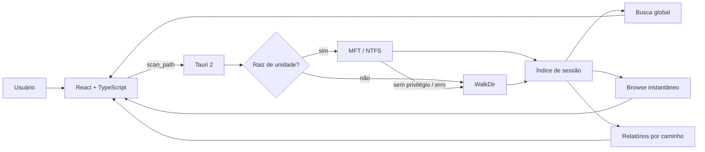
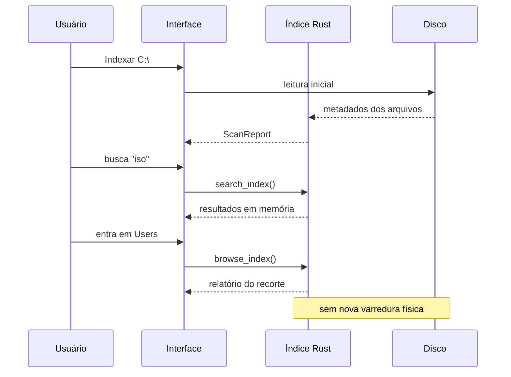
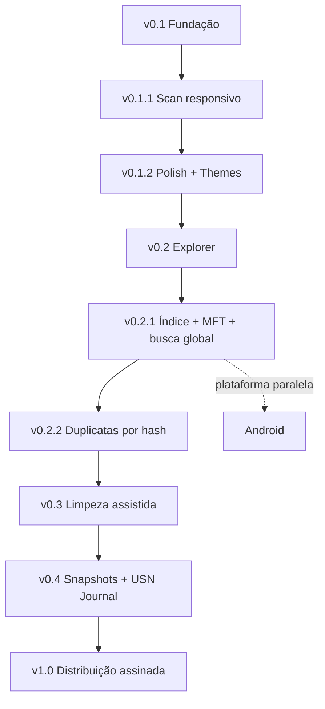

<div align="center">


# L.I.V.I.A.

### Leitura Inteligente e Visualização de Informações de Armazenamento

**Entenda o que ocupa seu disco, pesquise o índice inteiro e navegue sem ficar reescaneando a mesma árvore.**


</div>

---

## Visão geral

A **L.I.V.I.A.** é um analisador de armazenamento local-first para Windows. Ela percorre pastas e unidades, organiza consumo por diretório e extensão, mostra os maiores arquivos e aponta itens que merecem revisão.

Na **v0.2.1**, a análise deixa de ser apenas um relatório descartável e passa a construir um **índice de sessão**. Busca, filtros e drill-down trabalham nesse índice em vez de obrigar o disco a reviver a mesma caminhada toda vez que o usuário clica numa pasta. Um conceito revolucionário conhecido como “não fazer trabalho duas vezes”.

## Estado atual

| Recurso | Estado |
| --- | :---: |
| Scanner Rust responsivo | ✅ |
| Progresso e cancelamento | ✅ |
| Tema claro e escuro | ✅ |
| Treemap interativo | ✅ |
| Breadcrumb / drill-down | ✅ |
| Índice completo da sessão | ✅ v0.2.1 |
| Busca global no índice | ✅ v0.2.1 |
| Navegação sem nova varredura | ✅ v0.2.1 |
| MFT automático em raiz NTFS | ✅ experimental |
| Fallback seguro sem MFT | ✅ |
| Abrir arquivo no Explorer | ✅ |
| Triagem inicial de duplicatas | ✅ |
| Hash de duplicatas | 🗓️ Próxima etapa |
| Android | 🗓️ Futuro |

## v0.2.1 — Index & Search

### Entregas

- [x] indexar todos os arquivos encontrados durante a análise;
- [x] manter o índice somente na sessão;
- [x] pesquisa global por nome ou caminho;
- [x] filtros por extensão e tamanho sobre o índice completo;
- [x] ordenação no backend;
- [x] drill-down pelo treemap sem nova leitura física;
- [x] breadcrumb usando o mesmo índice;
- [x] painel informa quantos arquivos estão indexados;
- [x] tentativa automática de enumeração NTFS/MFT ao analisar a raiz de uma unidade;
- [x] fallback transparente para o scanner compatível quando MFT não puder ser usado;
- [x] README atualizado;
- [x] validar CI Windows;
- [x] validar instalador;
- [ ] publicar v0.2.1.

### MFT e privilégios

O caminho acelerado usa enumeração da **Master File Table** quando a análise parte da raiz de uma unidade NTFS e o processo possui privilégios suficientes.

O acesso direto à MFT no Windows requer elevação. A L.I.V.I.A. **não se autoeleva** e não força UAC. Se o acesso não estiver disponível, a análise continua com o scanner convencional e informa o fallback na interface.

Isso é intencional: pedir permissão administrativa automaticamente só para parecer rápido seria uma maneira impressionante de piorar ainda mais a primeira impressão de um aplicativo que já precisa lidar com SmartScreen.

## Arquitetura



## Fluxo de navegação indexada



## Como a busca funciona

O índice armazena metadados de cada arquivo encontrado:

- caminho;
- nome;
- tamanho;
- extensão;
- data de modificação;
- idade calculada.

A interface pede ao backend somente os resultados necessários. O backend filtra o índice completo e devolve até 200 itens por consulta.

O índice não é persistido entre execuções ainda. Persistência incremental via USN Journal fica para uma fase posterior.

## Segurança

A L.I.V.I.A. continua **somente leitura**.

O caminho MFT também é somente leitura. Se ele não estiver disponível, o aplicativo não tenta “consertar” permissões, não altera políticas do Windows e não cria serviço privilegiado.

### SmartScreen

As builds ainda não possuem assinatura Authenticode com certificado confiável. O Windows pode exibir **Fornecedor desconhecido** até que a distribuição passe a ser assinada.

## Stack

| Camada | Tecnologia |
| --- | --- |
| Desktop | Tauri 2 |
| Scanner compatível | Rust + WalkDir |
| Scanner acelerado | NTFS MFT via Windows |
| Índice | memória da sessão |
| Interface | React 19 + TypeScript |
| Visualização | Recharts |
| CI / Release | GitHub Actions |

## Desenvolvimento

```bash
npm install
npm run tauri dev
```

Build Windows:

```bash
npm run tauri build
```

## Roadmap



### v0.2.2 — Duplicatas confiáveis
- agrupamento global por tamanho;
- hash rápido parcial;
- confirmação por hash completo;
- cálculo confiável do espaço potencialmente recuperável.

### v0.3 — Limpeza assistida
- seleção múltipla;
- prévia do espaço recuperável;
- lixeira em vez de exclusão direta;
- histórico;
- desfazer quando possível.

### v0.4 — Persistência e mudanças
- snapshots locais;
- índice persistente;
- USN Journal para atualizar somente o que mudou;
- comparação de crescimento entre períodos.

### Android — futuro
- protótipo Tauri 2;
- Storage Access Framework;
- UI adaptada para toque;
- compartilhamento das regras de classificação compatíveis.

## Design

A referência visual contínua é o [Impeccable](https://impeccable.style/): ferramenta desktop primeiro, decoração depois, e nenhuma interface tentando ganhar prêmio por quantidade de cards.

## Licença

MIT.
