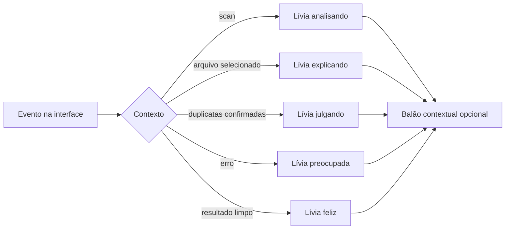
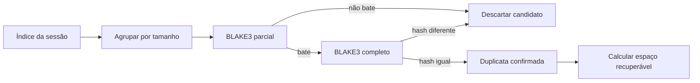
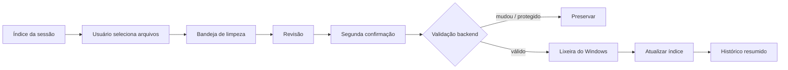
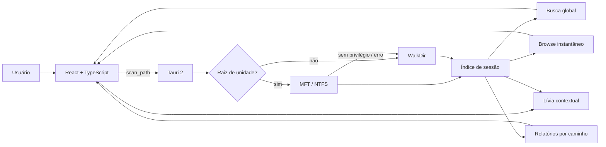
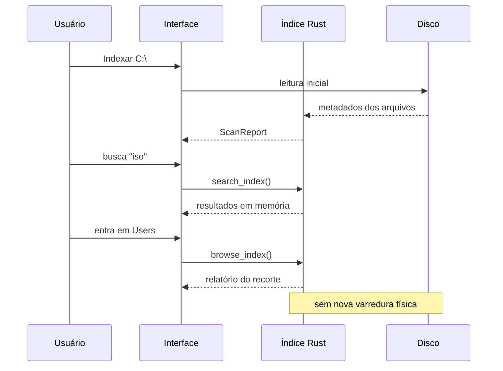
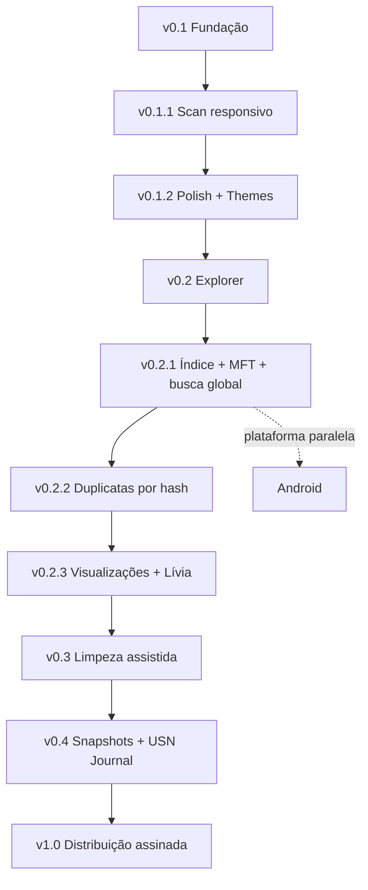

<div align="center">


# L.I.V.I.A.

### Leitura Inteligente e Visualização de Informações de Armazenamento

**Entenda o que ocupa seu disco, pesquise o índice inteiro e navegue sem ficar reescaneando a mesma árvore.**


</div>

---

## Visão geral

A **L.I.V.I.A.** é um analisador de armazenamento local-first para Windows. Ela percorre pastas e unidades, organiza consumo por diretório e extensão, mostra os maiores arquivos e aponta itens que merecem revisão.

Na **v0.2.1**, a análise deixa de ser apenas um relatório descartável e passa a construir um **índice de sessão**. Busca, filtros e drill-down trabalham nesse índice em vez de obrigar o disco a reviver a mesma caminhada toda vez que o usuário clica numa pasta. Um conceito revolucionário conhecido como “não fazer trabalho duas vezes”.

## Conheça a Lívia

A interface agora tem uma personagem própria: **Lívia**, a cyber assistente que vive no canto do aplicativo e reage ao que está acontecendo sem interromper o trabalho.

Ela foi desenhada para ser útil antes de ser decorativa: cabelo lilás/prateado, olhos violeta, headset tecnológico e a mesma linguagem visual roxa do app. A personalidade é divertida, irônica e direta, mas as recomendações continuam conservadoras. A personagem pode fazer piada com a pasta Downloads; a aplicação continua sem autorização para fazer besteira no disco.

- **Analisando:** acompanha a varredura e mostra o progresso em linguagem humana.
- **Explicando:** ao selecionar arquivos como DLL, PAK, ISO, SYS, ZIP ou JSON, explica o que aquele tipo normalmente representa.
- **Julgando com carinho:** comenta arquivos muito antigos e duplicatas confirmadas.
- **Contextual:** usa os assets oficiais **Normal, Feliz, Explicando, Julgando, Preocupada e Escaneando** conforme o estado do aplicativo.
- **Não intrusiva:** o avatar fica no canto; o balão pode ser fechado e reaparece apenas em eventos relevantes.
- **Seguro por design:** nenhuma fala da Lívia transforma sugestão em exclusão automática.

### Assets oficiais da personagem

A tira acima é a fonte visual usada pelo próprio aplicativo. Não existe mais uma “versão vetorial aproximada” da mascote: o avatar do canto usa os mesmos chibis aprovados, recortados como sprites.

| Estado visual | Uso principal |
| --- | --- |
| **Normal** | espera / início |
| **Feliz** | análise concluída sem grande alerta |
| **Explicando** | arquivo selecionado e explicações de extensão |
| **Julgando** | duplicatas, excesso de itens e comentários irônicos |
| **Preocupada** | erros e situações que pedem cautela |
| **Escaneando** | varredura do disco e confirmação por hash |




## Estado atual

| Recurso | Estado |
| --- | :---: |
| Scanner Rust responsivo | ✅ |
| Progresso e cancelamento | ✅ |
| Tema claro e escuro | ✅ |
| Guia contextual Lívia | ✅ v0.2.3 |
| Explicações por tipo de arquivo | ✅ v0.2.3 |
| Treemap interativo | ✅ |
| Pizza/Donut por pasta e extensão | ✅ v0.2.3 |
| Preferência de visualização persistente | ✅ v0.2.3 |
| Breadcrumb / drill-down | ✅ |
| Índice completo da sessão | ✅ v0.2.1 |
| Busca global no índice | ✅ v0.2.1 |
| Navegação sem nova varredura | ✅ v0.2.1 |
| MFT automático em raiz NTFS | ✅ experimental |
| Fallback seguro sem MFT | ✅ |
| Abrir arquivo no Explorer | ✅ |
| Triagem inicial de duplicatas | ✅ |
| Hash parcial + confirmação completa | ✅ v0.2.2 |
| Espaço recuperável confirmado | ✅ v0.2.2 |
| Limpeza assistida para a Lixeira | ✅ v0.3.0 |
| Android | 🗓️ Futuro |

## v0.2.1 — Index & Search

### Entregas

- [x] indexar todos os arquivos encontrados durante a análise;
- [x] manter o índice somente na sessão;
- [x] pesquisa global por nome ou caminho;
- [x] filtros por extensão e tamanho sobre o índice completo;
- [x] ordenação no backend;
- [x] drill-down pelo treemap sem nova leitura física;
- [x] breadcrumb usando o mesmo índice;
- [x] painel informa quantos arquivos estão indexados;
- [x] tentativa automática de enumeração NTFS/MFT ao analisar a raiz de uma unidade;
- [x] fallback transparente para o scanner compatível quando MFT não puder ser usado;
- [x] README atualizado;
- [x] validar CI Windows;
- [x] validar instalador;
- [x] publicar v0.2.1.

### MFT e privilégios

O caminho acelerado usa enumeração da **Master File Table** quando a análise parte da raiz de uma unidade NTFS e o processo possui privilégios suficientes.

O acesso direto à MFT no Windows requer elevação. A L.I.V.I.A. **não se autoeleva** e não força UAC. Se o acesso não estiver disponível, a análise continua com o scanner convencional e informa o fallback na interface.

Isso é intencional: pedir permissão administrativa automaticamente só para parecer rápido seria uma maneira impressionante de piorar ainda mais a primeira impressão de um aplicativo que já precisa lidar com SmartScreen.

## v0.2.2 — Duplicatas confiáveis

A verificação de duplicatas agora acontece **sob demanda**. A indexação inicial continua leve: primeiro os candidatos são agrupados por tamanho, depois a L.I.V.I.A. calcula um hash BLAKE3 de amostras do início e do fim dos arquivos e só lê o conteúdo inteiro dos grupos que continuam iguais.

### Entregas

- [x] agrupar candidatos em todo o índice pelo tamanho exato;
- [x] ignorar arquivos menores que 1 MB para evitar ruído;
- [x] hash parcial BLAKE3 com amostras de 64 KiB do início e do fim;
- [x] hash completo apenas nos candidatos que sobrevivem à triagem;
- [x] rejeitar arquivos cujo tamanho mudou desde a indexação;
- [x] mostrar progresso da verificação na interface;
- [x] mostrar grupos confirmados e espaço potencialmente recuperável;
- [x] manter a operação estritamente somente leitura;
- [x] validar CI Windows e instalador;
- [x] publicar v0.2.2.

### Fluxo da confirmação



Nenhum arquivo é removido nesta fase. A L.I.V.I.A. só prova que os conteúdos são iguais e mostra onde eles estão. Humanos continuam responsáveis pelo botão destrutivo, uma tradição que estranhamente ainda faz sentido.

## v0.2.4 — Hotfix da Lívia

A v0.2.4 corrige um problema de empacotamento do asset da personagem: o arquivo WebP da sprite sheet havia sido publicado incompleto, então GitHub e aplicativo reservavam o espaço da imagem, mas não conseguiam decodificá-la.

### Correções

- [x] republicar a sprite sheet da Lívia como WebP válido;
- [x] restaurar a personagem no avatar do aplicativo;
- [x] restaurar a tira de expressões no README;
- [x] manter os estados **Normal, Feliz, Explicando, Julgando, Preocupada e Escaneando**;
- [x] validar o asset antes da release;
- [x] validar CI Windows e instalador;
- [x] publicar v0.2.4.

## v0.2.3 — Visualizações + Lívia

A área de análise agora pode alternar entre visualizações sem recalcular o índice. O objetivo é permitir leitura detalhada e leitura rápida do mesmo conjunto de dados, porque aparentemente uma única forma de enxergar 191 GB de Steam não era humilhante o bastante.

### Entregas

- [x] alternância **Mapa / Pizza** para distribuição por pasta;
- [x] alternância **Lista / Pizza** para extensões;
- [x] gráfico donut responsivo usando Recharts;
- [x] legenda com porcentagem, tamanho e contagem de arquivos;
- [x] agrupamento de categorias menores em **Outros**;
- [x] navegação pelo índice clicando em fatias e itens de pasta;
- [x] preferência de visualização salva localmente;
- [x] suporte aos temas claro e escuro;
- [x] avatar persistente da Lívia no canto da interface;
- [x] estados visuais contextuais para análise, resultado, erro, duplicatas e seleção de arquivo;
- [x] balões opcionais que abrem em eventos relevantes e podem ser fechados;
- [x] explicações para tipos comuns como DLL, PAK, SYS, ISO, ZIP, JSON e bancos locais;
- [x] comentários contextuais para arquivos antigos e duplicatas confirmadas;
- [x] suporte responsivo e integração com os temas claro e escuro;
- [x] validar CI Windows e instalador;
- [x] publicar v0.2.3.

## v0.3.0 — Limpeza assistida

A L.I.V.I.A. agora sai do modo “eu só observo a bagunça” e passa a ajudar na limpeza sem ganhar um lança-chamas apontado para o sistema de arquivos.

### Fluxo seguro

- [x] adicionar arquivos individualmente à bandeja de limpeza;
- [x] revisar quantidade e espaço antes de qualquer ação;
- [x] exigir uma segunda confirmação;
- [x] conferir se o arquivo ainda pertence ao índice;
- [x] conferir novamente tamanho e tipo antes de mover;
- [x] preservar arquivos que mudaram desde a indexação;
- [x] bloquear a pasta do Windows e o executável atual;
- [x] mover para a Lixeira do sistema, nunca excluir permanentemente;
- [x] atualizar o índice em memória depois da operação;
- [x] manter histórico local resumido sem persistir caminhos de arquivos;
- [x] fazer a Lívia reagir à seleção, execução e conclusão da limpeza;
- [ ] restauração direta pela interface.



## Arquitetura



## Fluxo de navegação indexada



## Como a busca funciona

O índice armazena metadados de cada arquivo encontrado:

- caminho;
- nome;
- tamanho;
- extensão;
- data de modificação;
- idade calculada.

A interface pede ao backend somente os resultados necessários. O backend filtra o índice completo e devolve até 200 itens por consulta.

O índice não é persistido entre execuções ainda. Persistência incremental via USN Journal fica para uma fase posterior.

## Segurança

A análise, a indexação, a busca, o MFT e a confirmação de duplicatas continuam **somente leitura**.

A partir da **v0.3.0**, existe uma ação explícita de limpeza assistida. Ela só opera sobre arquivos que o usuário selecionou, exige revisão e confirmação, valida novamente tamanho e tipo do arquivo antes da ação e usa a **Lixeira do sistema** em vez de exclusão permanente. Arquivos dentro da pasta do Windows e o executável atual da L.I.V.I.A. são bloqueados pelo backend.

O caminho MFT também é somente leitura. Se ele não estiver disponível, o aplicativo não tenta “consertar” permissões, não altera políticas do Windows e não cria serviço privilegiado.

### SmartScreen

As builds ainda não possuem assinatura Authenticode com certificado confiável. O Windows pode exibir **Fornecedor desconhecido** até que a distribuição passe a ser assinada.

## Stack

| Camada | Tecnologia |
| --- | --- |
| Desktop | Tauri 2 |
| Scanner compatível | Rust + WalkDir |
| Scanner acelerado | NTFS MFT via Windows |
| Índice | memória da sessão |
| Interface | React 19 + TypeScript |
| Visualização | Recharts |
| CI / Release | GitHub Actions |

## Desenvolvimento

```bash
npm install
npm run tauri dev
```

Build Windows:

```bash
npm run tauri build
```

## Roadmap



### v0.2.2 — Duplicatas confiáveis
- ✅ agrupamento global por tamanho;
- ✅ hash rápido parcial BLAKE3;
- ✅ confirmação por hash completo;
- ✅ cálculo confiável do espaço potencialmente recuperável.

### v0.2.3 — Visualizações + Lívia
- ✅ mapa/treemap interativo;
- ✅ gráficos de pizza/donut para pastas e extensões;
- ✅ troca de modo sem reindexação;
- ✅ preferências persistentes;
- ✅ Lívia como guia visual dentro do app;
- ✅ explicações contextuais de arquivos e reações por estado.

### v0.3 — Limpeza assistida
- ✅ seleção múltipla por bandeja de limpeza;
- ✅ prévia do espaço selecionado;
- ✅ Lixeira em vez de exclusão direta;
- ✅ validação do arquivo novamente antes de mover;
- ✅ proteção da pasta do Windows e do executável em uso;
- ✅ histórico local resumido das operações;
- ⏳ desfazer/restaurar diretamente pela L.I.V.I.A. quando a API permitir identificação segura do item na Lixeira.

### v0.4 — Persistência e mudanças
- snapshots locais;
- índice persistente;
- USN Journal para atualizar somente o que mudou;
- comparação de crescimento entre períodos.

### Android — futuro
- protótipo Tauri 2;
- Storage Access Framework;
- UI adaptada para toque;
- compartilhamento das regras de classificação compatíveis.

## Design

A referência visual contínua é o [Impeccable](https://impeccable.style/): ferramenta desktop primeiro, decoração depois, e nenhuma interface tentando ganhar prêmio por quantidade de cards.

## Licença

MIT.
